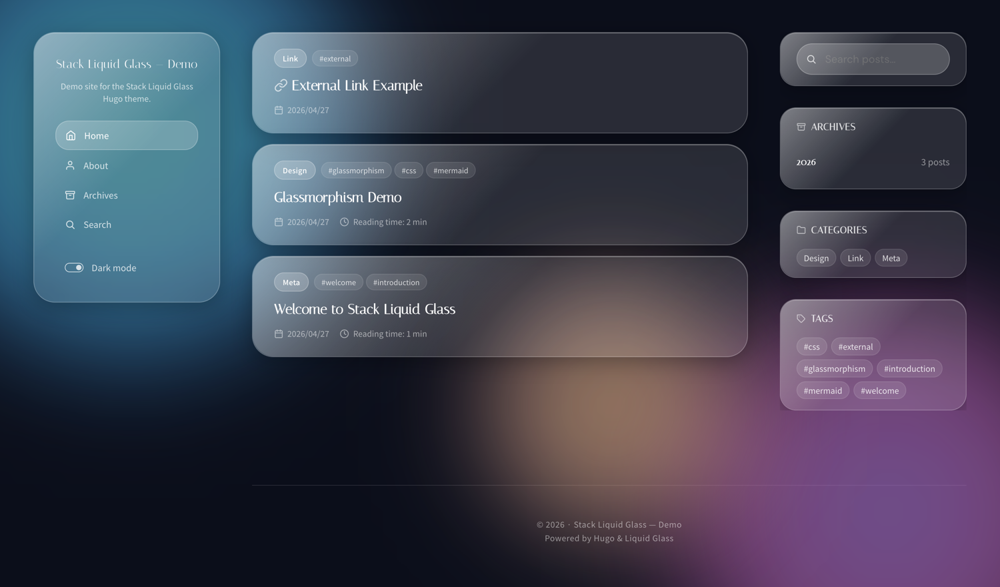

# Stack Liquid Glass

A glassmorphism-flavored Hugo theme — a liquid-glass redesign of [Hugo Theme Stack](https://github.com/CaiJimmy/hugo-theme-stack), with a near-zero JavaScript pipeline, light/dark mode, and built-in JSON search.

> 日本語: Hugo Theme Stack をベースに、ガラス質感（glassmorphism）の UI とほぼ JS なしの配信パイプラインに作り変えたテーマです。ライト/ダーク切替、`/index.json` ベースの全文検索、TOC、Mermaid、外部 URL 投稿、日本語 i18n に対応しています。



_Screenshot placeholder — see the demo site._

## Documentation

Full usage documentation (English / 日本語) is published at:

<https://rin2yh.github.io/hugo-theme-stack-liquid-glass/>

The docs site is built from `website/` in this repository. See [`website/content/`](website/content/) for the source.

## Features

- Glassmorphism / liquid-glass design tokens
- Light & dark mode toggle (system preference aware)
- Near-zero JS pipeline — Hugo Pipes concat + minify + fingerprint
- `/index.json` powered full-text search
- Table of contents (TOC) widget
- Mermaid diagram rendering
- Related posts
- External URL posts (`archetypes/external.md`)
- Japanese i18n out of the box
- Tabler-style SVG icons

## Requirements

- Hugo **extended** `>= 0.146.0`

## Installation

As a git submodule:

```bash
git submodule add https://github.com/rin2yh/hugo-theme-stack-liquid-glass themes/stack-liquid-glass
```

Or download the ZIP archive from GitHub and extract it into `themes/stack-liquid-glass/`.

Then enable the theme in your site's `hugo.toml`:

```toml
theme = "stack-liquid-glass"
```

## Required user-provided static assets

`layouts/partials/head/head.html` references the following files **from your site's `static/` directory** (they are intentionally not bundled with the theme so each site can use its own brand assets):

- `static/apple-touch-icon.png`
- `static/favicon-32x32.png`
- `static/favicon-16x16.png`
- `static/favicon.ico`
- `static/site.webmanifest`

If you do not provide these, the corresponding `<link>` tags in `<head>` will 404 — the rest of the site still works.

### Icons for `[[menu]]` / `[[social]]` entries

Icons referenced from `[[menu]]` or `[[social]]` entries (via `params.icon`) are resolved from `assets/icons/<name>.svg`. The theme ships a generic icon set (`home`, `search`, `archives`, `rss`, `tag`, `folder`, `user`, `clock`, `date`, `external`, `link`, `list`, `moon`, `sun`, `language`, `copyright`, `clipboard`, `donate-heart`, `qr-code`). Service-specific icons (e.g. for GitHub, Twitter, Zenn, Speaker Deck) are intentionally not bundled — place the corresponding SVG in your own site's `assets/icons/<name>.svg` and reference it from the menu entry. Hugo's asset pipeline resolves the project's `assets/` before the theme's, so site-provided icons take precedence and supplement the theme set.

If an icon name resolves to no file, the icon slot renders empty but the link itself still works.

## Configuration

A minimal `hugo.toml` for a site using this theme:

```toml
baseURL = "https://example.com/"
languageCode = "en"
title = "My Site"
theme = "stack-liquid-glass"
hasCJKLanguage = false

[outputs]
home = ["HTML", "RSS", "JSON"]

[permalinks]
post = "/post/:contentbasename/"

[markup.goldmark.renderer]
unsafe = true
[markup.tableOfContents]
ordered = true
startLevel = 2
endLevel = 4

[params]
mainSections = ["post"]
rssFullContent = true
[params.dateFormat]
published = "2006/01/02"
lastUpdated = "2006/01/02 15:04 MST"
[params.sidebar.avatar]
enabled = true
local = true
src = "image/avatar.webp"
[[params.widgets.homepage]]
type = "search"
[[params.widgets.homepage]]
type = "archives"
[[params.widgets.homepage]]
type = "categories"
[params.widgets.homepage.params]
limit = 10
[[params.widgets.homepage]]
type = "tag-cloud"
[params.widgets.homepage.params]
limit = 10
[[params.widgets.page]]
type = "twitter-share"
[[params.widgets.page]]
type = "toc"

[[menu.main]]
identifier = "home"
name = "Home"
url = "/"
weight = 1
[menu.main.params]
icon = "home"
```

## Available widgets

- `search`
- `archives`
- `categories`
- `tag-cloud`
- `toc`
- `twitter-share`
- `profile`

## Available shortcodes

- `` — render a QR code for the given text.

## External dependencies (CDN)

The theme loads a few resources from public CDNs:

- Google Fonts — Italiana, DM Sans, Noto Sans JP, JetBrains Mono
- Mermaid — `https://cdn.jsdelivr.net/npm/mermaid@10` (loaded from `layouts/_default/baseof.html`)

## Local preview

To preview the bundled `exampleSite/`:

```bash
cd exampleSite && hugo server
```

The `exampleSite/themes/stack-liquid-glass` entry is a symlink back to the
repository root, so Hugo can resolve the theme without any extra flags.

## Versioning

The theme follows [Semantic Versioning](https://semver.org/). The "public API"
that the version number guarantees stability for is:

- **`params.*` keys** read by the theme's templates.
- **Layout files** that downstream sites are expected to override under
  `layouts/` (e.g. `partials/article/header.html`, `_default/baseof.html`).
- **i18n keys** under `i18n/*.toml`.

The following are explicitly **not** part of the public API and may change in
patch or minor releases without a breaking-change marker:

- CSS class names and design tokens (`assets/css/`).
- JavaScript globals (e.g. `window.lgI18n`) and inline script internals.
- Internal partial helpers under `layouts/partials/helper/`.
- File names of bundled icons under `assets/icons/`.

While in `0.x`, breaking changes to the public API bump the **minor** version
rather than jumping to `1.0.0`. Sites that depend on internals should pin to
a specific tag rather than tracking `main`.

## Credits

- Based on [Hugo Theme Stack](https://github.com/CaiJimmy/hugo-theme-stack) by Jimmy Cai (MIT).
- Icons inspired by [Tabler Icons](https://tabler.io/icons) and [Feather Icons](https://feathericons.com/) (MIT).
- Brand icons (GitHub, X/Twitter, Speaker Deck, Zenn) are trademarks of their respective owners and are bundled in `assets/icons/` solely as link icons referencing those services. No affiliation or endorsement is implied.

## License

MIT License.

- Copyright (c) 2026 rin2yh
- Copyright (c) 2020 Jimmy Cai (original Hugo Theme Stack)

See [LICENSE](LICENSE) for details.
