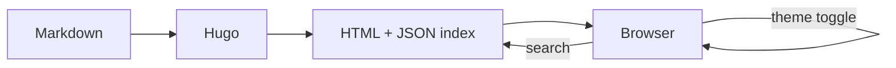

This post demonstrates several theme features at once: a multi-section layout that exercises the table of contents, a Mermaid diagram, and a syntax-highlighted code block.

## Design tokens

Stack Liquid Glass exposes its visual language through CSS custom properties — surface colors, blur radii, border alpha, and accent gradients are all centralized so you can re-skin the theme by overriding a handful of variables.

Each surface ("card", "sidebar", "menu") shares the same base recipe: a translucent fill, a soft border, a subtle drop shadow, and a backdrop blur. Light and dark modes swap the underlying tokens but keep the geometry identical.

## Architecture

The diagram below is rendered with Mermaid, which the theme loads on demand from jsDelivr.



Because Mermaid only loads when a `mermaid` code fence is present on the page, posts without diagrams stay lightweight.

## Code highlighting

Hugo's Chroma highlighter is enabled with classes, so the theme can style code blocks consistently across both color modes.

```js
// Toggle the theme and persist the choice.
const root = document.documentElement;
const next = root.dataset.theme === "dark" ? "light" : "dark";
root.dataset.theme = next;
localStorage.setItem("theme", next);
```

## Wrap up

Three H2 sections plus an intro is enough to make the TOC widget on the right-hand side meaningful. Scroll the page and notice that the active section highlights as you go.
