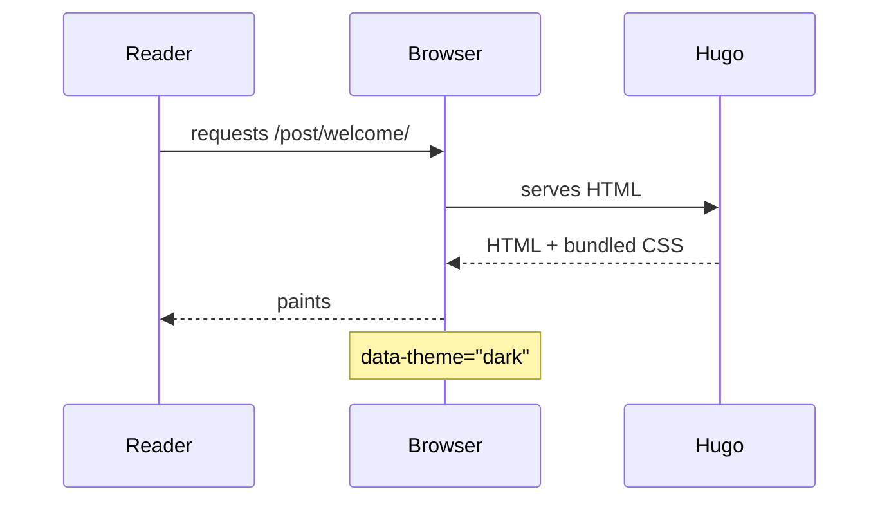
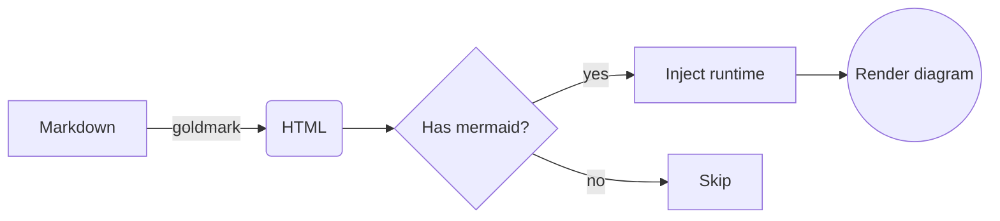

+++
title = "Mermaid diagrams"
date = 2026-04-12
categories = ["Showcase"]
tags = ["mermaid", "diagrams"]
description = "Mermaid is loaded lazily — only when a page actually contains a `mermaid` fenced block."
+++

The theme detects mermaid code fences during render and injects the mermaid runtime *only on those pages*, so unrelated posts pay zero cost. The runtime auto-picks `default` or `dark` based on the active theme attribute.

## Sequence

## Flowchart

## Notes

- The runtime is loaded from a CDN ESM URL. Self-host it by replacing the `import` URL in `layouts/_default/baseof.html`.
- Diagram colors follow mermaid's built-in `default` / `dark` themes; for finer control wrap your blocks in `%%{init: ...}%%` directives.
